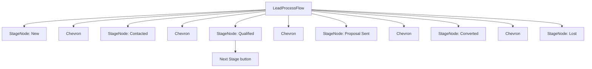

# Design Document: Lead BPF Bar

## Overview

The Lead BPF (Business Process Flow) Bar adds a horizontal stage-progress indicator to the Lead Detail view, modelled after the Dynamics 365 BPF bar. It is a single, fully-controlled React component (`LeadProcessFlow`) that visualises the lead's position in the sales pipeline, allows direct stage navigation by click, and provides a "Next Stage" button for forward progression.

The component introduces no new state, no new types, and no new data-fetching. It is a pure presentation layer wired to the existing `useCRM.updateLeadStatus` callback already present in `LeadDetail.tsx`.

---

## Architecture

The feature is a single new component inserted at one integration point.

```
LeadDetail.tsx
└── <div className="flex-1 overflow-y-auto p-6">   ← existing scrollable body
    ├── <LeadProcessFlow />                          ← NEW — first child
    └── <div className="max-w-6xl mx-auto grid …">  ← existing content grid
```

Data flow is strictly top-down (controlled component pattern):

```
useCRM.updateLeadStatus
        │
        ▼
  LeadDetail (passes lead.id, lead.status, onStatusChange)
        │
        ▼
  LeadProcessFlow (reads props, fires onStatusChange on interaction)
```

No state is lifted; no new context is introduced.

---

## Components and Interfaces

### LeadProcessFlow

**File:** `src/modules/lead-management/components/LeadProcessFlow.tsx`

```typescript
import { LeadStatus } from '../types';

interface LeadProcessFlowProps {
  leadId: string;
  currentStatus: LeadStatus;
  onStatusChange: (leadId: string, status: LeadStatus) => void;
}
```

**Responsibilities:**
- Derive `stageIndex` (position of `currentStatus` in the ordered stage array)
- Classify each stage as `completed | active | upcoming`
- Render stage nodes with appropriate visual treatment
- Render chevron connectors between adjacent stages
- Render "Next Stage" button on the active stage when it is not terminal
- Fire `onStatusChange` on stage click or Next Stage click

**Internal constants (not exported, not state):**

```typescript
const STAGES: LeadStatus[] = [
  'New', 'Contacted', 'Qualified', 'Proposal Sent', 'Converted', 'Lost'
];

const TERMINAL_STAGES: ReadonlySet<LeadStatus> = new Set(['Converted', 'Lost']);
```

Stage classification is a pure derivation from `currentStatus`:

```typescript
type StageState = 'completed' | 'active' | 'upcoming';

function classifyStage(index: number, activeIndex: number): StageState {
  if (index < activeIndex) return 'completed';
  if (index === activeIndex) return 'active';
  return 'upcoming';
}
```

### Integration change in LeadDetail.tsx

One import and one JSX line are added. No props, state, or handlers change.

```tsx
// new import
import { LeadProcessFlow } from '../components/LeadProcessFlow';

// inside the scrollable body div, before the grid
<div className="flex-1 overflow-y-auto p-6">
  <LeadProcessFlow
    leadId={lead.id}
    currentStatus={lead.status}
    onStatusChange={onStatusChange}
  />
  <div className="max-w-6xl mx-auto grid …">
    {/* existing content unchanged */}
  </div>
</div>
```

### Error Boundary

A lightweight error boundary wraps `LeadProcessFlow` inside `LeadDetail` so that a render error in the BPF bar does not unmount the rest of the lead detail view. A simple class component or the `react-error-boundary` package (already common in React projects) is sufficient. The fallback renders nothing (or a minimal "Pipeline unavailable" notice), leaving the rest of the page intact.

---

## Data Models

No new data models are introduced. The component derives all display state from the existing `LeadStatus` type and the `STAGES` constant.

### Stage classification table

| currentStatus  | Completed stages (before) | Active | Upcoming stages (after) |
|----------------|--------------------------|--------|------------------------|
| New            | —                        | New    | Contacted, Qualified, Proposal Sent, Converted, Lost |
| Contacted      | New                      | Contacted | Qualified, Proposal Sent, Converted, Lost |
| Qualified      | New, Contacted           | Qualified | Proposal Sent, Converted, Lost |
| Proposal Sent  | New, Contacted, Qualified | Proposal Sent | Converted, Lost |
| Converted      | New, Contacted, Qualified, Proposal Sent | Converted | Lost |
| Lost           | New, Contacted, Qualified, Proposal Sent, Converted | Lost | — |

### Visual state → Tailwind class mapping

| State     | Background          | Text                    | Border / Ring           | Check icon |
|-----------|---------------------|-------------------------|-------------------------|------------|
| completed | `bg-primary`        | `text-primary-foreground` | —                       | yes        |
| active    | `bg-accent`         | `text-accent-foreground`  | `ring-2 ring-primary`   | no         |
| upcoming  | `bg-muted`          | `text-muted-foreground`   | `border border-border`  | no         |

Chevron connectors use `text-border` (a thin SVG or a CSS border trick) so they adapt to both light and dark themes via the CSS variable.

---

## Visual Design

### Layout

```
┌──────────────────────────────────────────────────────────────────────────────┐
│  [✓ New] ›  [✓ Contacted] ›  [● Qualified ▼ Next Stage] ›  [Proposal Sent] ›  [Converted] ›  [Lost]  │
└──────────────────────────────────────────────────────────────────────────────┘
```

- The bar spans full width (`w-full`) with `flex items-center` layout.
- Each stage node is a `<button>` (keyboard accessible, fires `onStatusChange` on click).
- Chevron connectors (`›`) are non-interactive decorative elements (`aria-hidden="true"`).
- The "Next Stage" button is rendered below the active stage label, inside the active stage node.
- On narrow viewports the bar scrolls horizontally (`overflow-x-auto`) rather than wrapping.

### Mermaid diagram — component tree



*(Diagram shows Qualified as the active stage for illustration.)*

---

## Correctness Properties

*A property is a characteristic or behavior that should hold true across all valid executions of a system — essentially, a formal statement about what the system should do. Properties serve as the bridge between human-readable specifications and machine-verifiable correctness guarantees.*

### Property 1: Stage order invariant

*For any* valid `LeadStatus` value passed as `currentStatus`, the six stage labels rendered by `LeadProcessFlow` must appear in the fixed order: New, Contacted, Qualified, Proposal Sent, Converted, Lost — left to right.

**Validates: Requirements 1.2**

---

### Property 2: Connector count invariant

*For any* valid `LeadStatus` value passed as `currentStatus`, the number of connector elements rendered between stages must equal exactly five (one between each adjacent pair of six stages).

**Validates: Requirements 1.3**

---

### Property 3: Stage classification partition

*For any* valid `LeadStatus` value passed as `currentStatus`, the component must render exactly one stage with the active style, a number of stages with the completed style equal to the index of `currentStatus` in the ordered sequence, and the remaining stages with the upcoming style — such that active + completed + upcoming = 6.

**Validates: Requirements 2.1, 2.2, 2.3, 2.4**

---

### Property 4: Stage click fires correct callback

*For any* valid `LeadStatus` value passed as `currentStatus` and *for any* stage node in the rendered bar, clicking that stage node must invoke `onStatusChange` with the `leadId` prop and the `LeadStatus` value that corresponds to the clicked stage.

**Validates: Requirements 3.1**

---

### Property 5: Next Stage button presence matches non-terminal status

*For any* valid `LeadStatus` value passed as `currentStatus`: if `currentStatus` is not `Converted` or `Lost`, a "Next Stage" button must be present in the rendered output; if `currentStatus` is `Converted` or `Lost`, no "Next Stage" button must be present.

**Validates: Requirements 4.1, 4.3**

---

### Property 6: Next Stage button advances to correct successor

*For any* valid non-terminal `LeadStatus` value passed as `currentStatus`, clicking the "Next Stage" button must invoke `onStatusChange` with the `leadId` prop and the `LeadStatus` value that immediately follows `currentStatus` in the ordered stage sequence.

**Validates: Requirements 4.2**

---

## Error Handling

| Scenario | Handling |
|---|---|
| `LeadProcessFlow` throws during render | Error boundary in `LeadDetail` catches the error; fallback renders nothing or a minimal notice; rest of lead detail remains visible |
| `currentStatus` value not found in `STAGES` | `STAGES.indexOf` returns `-1`; all stages render as `upcoming`; no Next Stage button; no crash |
| `onStatusChange` is not provided | TypeScript enforces the prop at compile time; no runtime guard needed |

---

## Testing Strategy

### Unit tests

Focus on specific examples, integration points, and error conditions:

- Renders without crashing for each of the six `LeadStatus` values
- Correct stage label text is present in the DOM
- Active stage has the expected CSS class
- Completed stages have the expected CSS class
- Upcoming stages have the expected CSS class
- Next Stage button is absent when `currentStatus` is `Converted`
- Next Stage button is absent when `currentStatus` is `Lost`
- Error boundary in `LeadDetail` renders fallback when `LeadProcessFlow` throws
- `LeadDetail` passes `lead.id`, `lead.status`, and `onStatusChange` to `LeadProcessFlow`

### Property-based tests

Use **fast-check** (TypeScript-native PBT library) with a minimum of **100 iterations per property**.

Each test is tagged with a comment in the format:
`// Feature: lead-bpf-bar, Property N: <property text>`

| Property | Test description |
|---|---|
| P1: Stage order invariant | Generate arbitrary `LeadStatus`; render component; assert stage labels appear in fixed order |
| P2: Connector count invariant | Generate arbitrary `LeadStatus`; render component; assert exactly 5 connector elements |
| P3: Stage classification partition | Generate arbitrary `LeadStatus`; render component; assert counts: 1 active, `indexOf(status)` completed, `5 - indexOf(status)` upcoming |
| P4: Stage click fires correct callback | Generate arbitrary `LeadStatus` for `currentStatus` and arbitrary stage index; simulate click; assert callback called with correct `leadId` and stage value |
| P5: Next Stage button presence | Generate arbitrary `LeadStatus`; render; assert button present iff status not in `{Converted, Lost}` |
| P6: Next Stage advances correctly | Generate arbitrary non-terminal `LeadStatus`; simulate Next Stage click; assert callback called with the successor status |

**Configuration:**

```typescript
import fc from 'fast-check';

const arbLeadStatus = fc.constantFrom(
  'New', 'Contacted', 'Qualified', 'Proposal Sent', 'Converted', 'Lost'
) as fc.Arbitrary<LeadStatus>;

const arbNonTerminalStatus = fc.constantFrom(
  'New', 'Contacted', 'Qualified', 'Proposal Sent'
) as fc.Arbitrary<LeadStatus>;
```

Each `fc.assert(fc.property(...), { numRuns: 100 })`.
